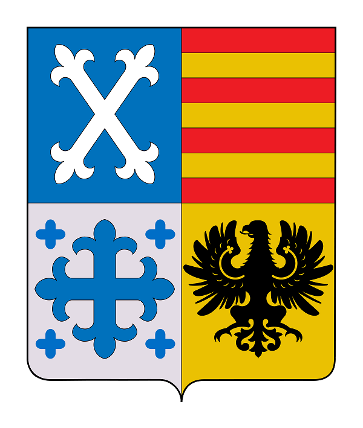

```{r setup, include = FALSE}
setwd("C:/Users/oienh/Documents/R_UNIVERSITY_PROJECTS/5th_Semester/trabajo_grupal_3")
knitr::opts_chunk$set(echo = FALSE, comment = NA)
library(readxl)
library(FinCal)
library(FinancialMath)
library(gt)
```

```{r, echo=FALSE, fig.align = "left"}

```

\center

# Trabajo Grupal 3
## 2023-05-20/2023-05-25

```{r, echo=FALSE, fig.align = "center"}

```

* Amanda Araya Orrego
* Lucas Oliva Valverde
* Melissa Sumi Ibata
* Exequiel Valdés Zúñiga

\newpage
\justifying


```{r}


# Datos a utilizar.
```

```{r}
dinero_millones <- function(x) {
    ifelse(round(x, 2) != 0,
      paste0("$", format(round(x, 2), big.mark = "\u202f", scientific = FALSE,
    decimal.mark = ","), "M"),
    "$ -")
}
# Formato de dinero en millones para añadir separadores de miles,
# coma decimal, y dos puntos decimales.

porcien <- function(x) {
    paste0(format(round(x, 2), big.mark = "\u202f", scientific = FALSE,
    decimal.mark = ",") * 100, "%")
}
# Formato para porcentajes en estilo SI francés (coma decimal).
```
# Introducciôn

# Emisión Bono Bullet

